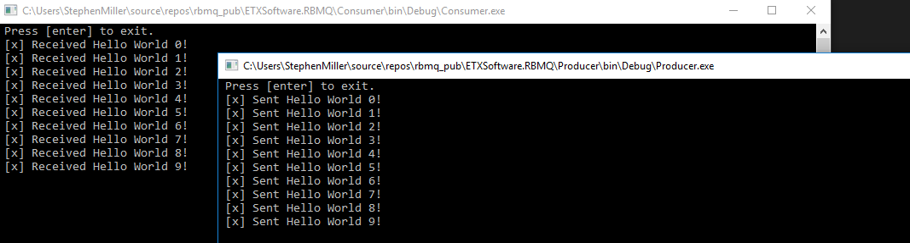
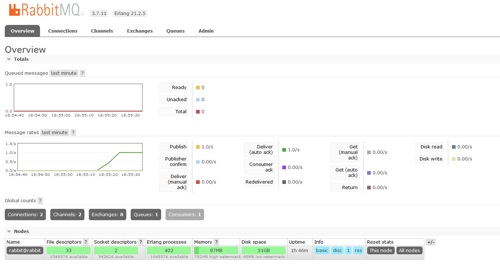

# Docker C# RabbitMQ "Hello World"

## Introduction
RabbitMQ is a popular message broker that is often used for exchanging data between services in a distributed system. Companies from small to big should consider RabbitMQ as a messaging solution if they have applications that frequently talk to each other. 

This tutorial will show you how you publish and subscribe messages from RabbitMQ message broker running inside a docker container. The code example will create a simple fanout exchange with one queue attached. 

# Prerequisites
1. Basic understanding of C#
2. Docker installed and running locally (See docs on installing docker https://docs.docker.com/)

# Setup
Clone the code example from https://github.com/EastTexasSoftware/rbmq_pub.git

The RabbitMQ broker can be started by running `docker-compose up` with the docker-compose example below. This will download the required RabbitMQ Docker images and start RabbitMQ with the Management Plugin enabled.

``` yaml
rabbit:
  image: "rabbitmq:3-management"
  hostname: "rabbit"
  environment:
    RABBITMQ_ERLANG_COOKIE: "QYKNHIUNJG"
    RABBITMQ_DEFAULT_VHOST: "/"
  ports:
    - "15672:15672"
    - "5672:5672"
  labels:
    NAME: "rabbitmq"
```

You can verify if the RabbitMQ is running by loading the Management Plugin `http://localhost:15672/` in your browser. The default login (user and password) us guest. ** Note the guest account only works if RabbitMQ is running and accessed the on localhost **

# Running the example

The ExchangeName, QueueName and RoutingKey have been declared in the a Common project.

``` csharp 
public const string ExchageName = "dev.exchange";
public const string QueueName = "dev.queue";
public const string RoutingKey = "dev.routing";
```

## Consumer

Before consuming we need to setup a connection to the RabbitMQ broker. This will create a new connection and create the channel that's required for communicating with the broker.

``` csharp
ConnectionFactory connectionFactory = new ConnectionFactory() { HostName = "localhost" };
using (IConnection connection = connectionFactory.CreateConnection())
using (IModel channel = connection.CreateModel())
{
    EventingBasicConsumer consumer;
    ...
    ...
}
```

After setting up the connection; we will need to declare an fanout exchange, queue and bind the queue to the exchange. 

``` csharp
_channel.ExchangeDeclare(
                   exchange: ExchageName,
                   type: "fanout",
                   durable: false,
                   autoDelete: false,
                   arguments: null);

_channel.QueueDeclare(queue: QueueName,
                    durable: false,
                    exclusive: false,
                    autoDelete: true,
                    arguments: null);

_channel.QueueBind(queue: QueueName,
                    exchange: ExchageName,
                    routingKey: RoutingKey,
                    arguments: null);
```

We can start the consumer by subscribing to the EventingBasicConsumer.Receive event and passing the consumer to the channel. 

``` csharp
_consumer.Received += (model, ea) =>
{
    var body = ea.Body;
    var message = Encoding.UTF8.GetString(body);
    Console.WriteLine(" [x] Received {0}", message);
};

_channel.BasicConsume(queue: QueueName,
                    autoAck: true,
                    consumer: _consumer);
```

## Producer

Now the cusomer is running, we can start the producer. 

Before producing we need to setup a connection to the RabbitMQ broker like we did in the consumer. 

``` csharp
ConnectionFactory connectionFactory = new ConnectionFactory() { HostName = "localhost" };
using (IConnection connection = connectionFactory.CreateConnection())
using (IModel channel = connection.CreateModel())
{
    ...
    ...
}
```

After setting up the connection, we will need to declare an fanout exchange.

``` csharp
 _channel.ExchangeDeclare(
                    exchange: ExchageName,
                    type: "fanout",
                    durable: false,
                    autoDelete: false,
                    arguments: null);
```

Now, we can finally start our producer and start sending messages to the message broker. This is done by starting a long running task that sends a new message every second.

``` csharp
new Task(() =>
{
    int count = 0;

    while (true)
    {
        try
        {
            string message = $"Hello World {count++}!";
            byte[] body = Encoding.UTF8.GetBytes(message);

            channel.BasicPublish(exchange: ExchageName,
                                    routingKey: RoutingKey,
                                    basicProperties: null,
                                    body: body);

            Console.WriteLine(" [x] Sent {0}", message);

        }
        catch (Exception exception)
        {
            Console.WriteLine($"Exception: {exception}");
        }
        using (ManualResetEvent mre = new ManualResetEvent(false))
            mre.WaitOne(TimeSpan.FromSeconds(1));
    }
}, TaskCreationOptions.LongRunning).Start();
```

The Producer console window should show a new message published every second and the consumer console window should show a new message being consumed every second.



The RabbitMQ Management Plugin `http://localhost:15672/` should also show messages being published and consumed. 



That's it!